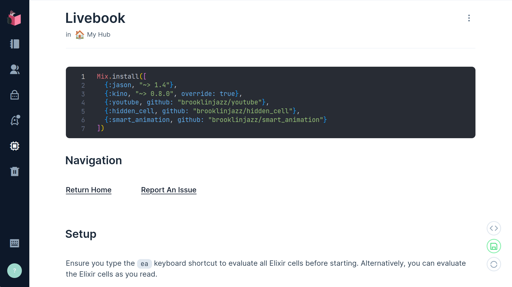
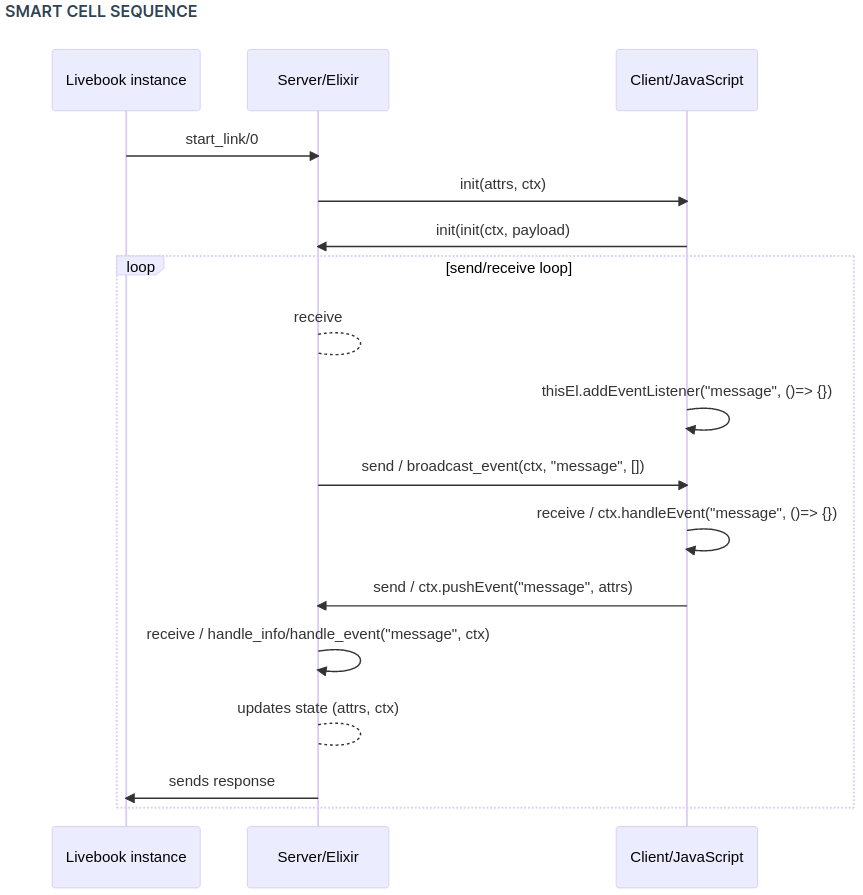
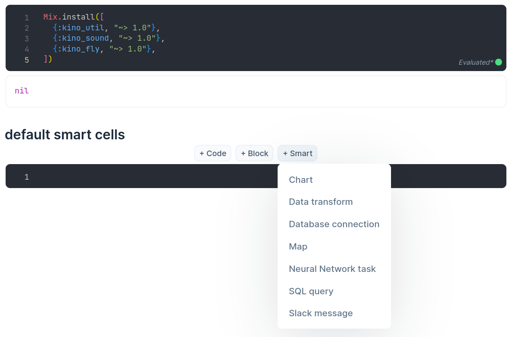
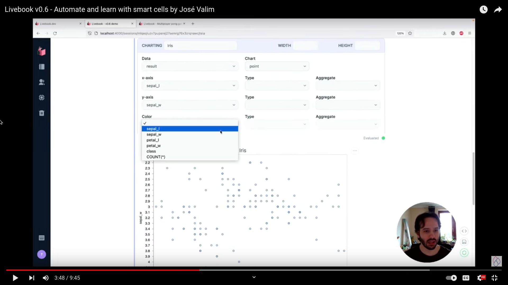
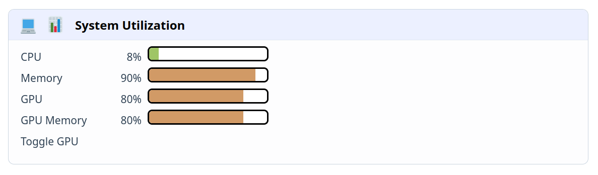
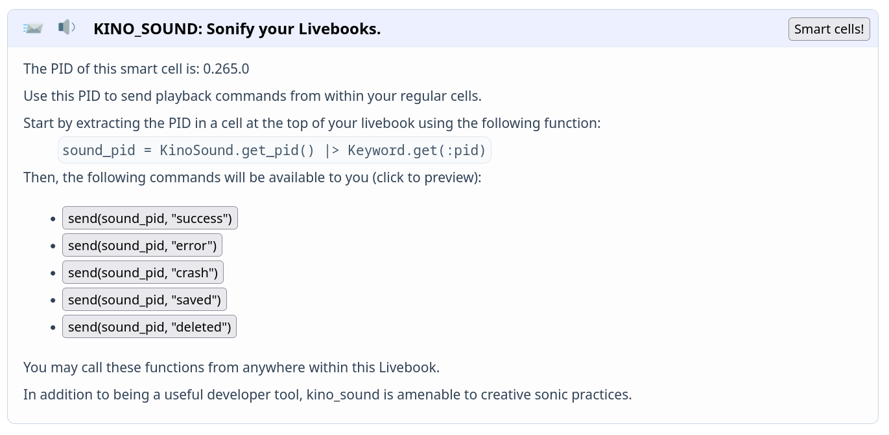
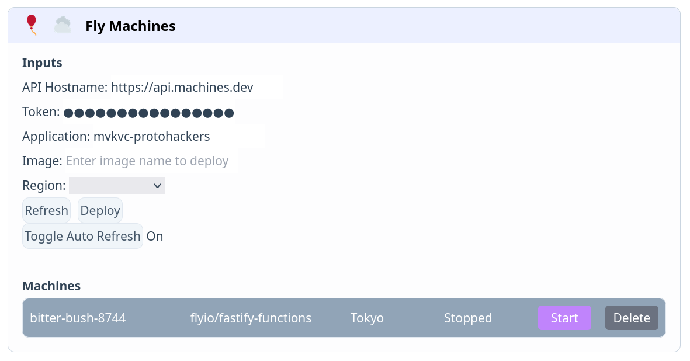

<!-- _color: #788CA9 -->
# Cell-Driven Development

Three examples of custom smart cells in Livebook.
<br>
<br>
Marko Vukovic&ensp;|&ensp;mvk.vc&ensp;|&ensp;@mvkvc
Einar Engström&ensp;|&ensp;einariii.xyz&ensp;|&ensp;@einariii

---
<!-- _backgroundColor: #C6D200 -->
# who we are/why we're here

- two early-career Elixir developers
- friends & collaborators
- recent graduates of DockYard Academy
- livebook was our platform for learning
- let's give back to the community

---
<!-- _backgroundColor: #D19A66 -->
# livebook introduction



---
<!-- _backgroundColor: #D19A66 -->
# livebook integrations


---
<!-- _backgroundColor: #D19A66 -->
# livebook apps


---
<!-- backgroundColor: #788CA9 -->
# smart cells

automated client-server programs
producing code in the background
great for testing & development

---
<!-- backgroundColor: #788CA9 -->


---
<!-- backgroundColor: #788CA9 -->


---
<!-- backgroundColor: #788CA9 -->


<https://livebook.dev>

---
<!-- _backgroundColor: #61AFEF -->
:brain::hammer:

```bash
mix new kino_util --sup
```

---
<!-- _backgroundColor: #E06C75 -->
:computer::bar_chart:

# kino_util

keep your system in sight.

<https://hex.pm/packages/kino_util>

---
<!-- _backgroundColor: #E06C75 -->
```elixir
defmodule KinoUtil.Application do
  use Application

  @impl true
  def start(_type, _args) do
    Kino.SmartCell.register(KinoUtil)

    children = []
    opts = [strategy: :one_for_one, name: KinoUtil.Supervisor]
    Supervisor.start_link(children, opts)
  end
end

```

---
<!-- _backgroundColor: #E06C75 -->
```elixir
defmodule KinoUtil do
  use Kino.JS, assets_path: "lib/assets"
  use Kino.JS.Live
  use Kino.SmartCell, name: "System utilization"
  alias KinoUtil.Utils

  ...

  @impl true
  def init(attrs, ctx) do
    # ...
  end

  @impl true
  def handle_info("show_gpu", ctx) do
    # ...
    {:noreply, ctx}
  end

  @impl true
  def handle_info("update", ctx) do
    # ...
    {:noreply, ctx}
  end

  ...
```

---
<!-- _backgroundColor: #E06C75 -->
```elixir
  ...
  @impl true
  def handle_connect(ctx) do
    {:ok, %{fields: ctx.assigns.fields}, ctx}
  end

  @impl true
  def to_attrs(ctx) do
    ctx.assigns.fields
  end

  @impl true
  def to_source(_attrs) do
    quote do
      # ...
    end
  end
end
```

---
<!-- _backgroundColor: #E06C75 -->
```javascript
import * as Vue from "https://cdn.jsdelivr.net/npm/vue@3.2.26/dist/vue.esm-browser.prod.js";

export function init(ctx, payload) {
  ctx.importCSS("output.css");

  const UtilBar = {...}};

  const app = Vue.createApp({...}).mount(ctx.root);

  ctx.handleEvent("show_gpu", (has_gpu) => {});

  ctx.handleEvent("update", (fields) => {});
}

```

---
<!-- _backgroundColor: #E06C75 -->


---
<!-- _backgroundColor: #E06C75 -->
:computer::bar_chart:

---
<!-- _backgroundColor: #98C379 -->
:incoming_envelope::sound:

# kino_sound

sonify your workflow.

<https://hex.pm/packages/kino_sound>

---
<!-- _backgroundColor: #98C379 -->
call & response:
a smart cell that allows regular cells
to send commands
to the howler.js framework
which sings back

---
<!-- _backgroundColor: #98C379 -->


---
<!-- _backgroundColor: #98C379 -->
:incoming_envelope::sound:

---
<!-- _backgroundColor: #DA70D6 -->
:balloon::cloud:

# kino_fly

cloud's-eye view with fly machines.

<https://hex.pm/packages/kino_fly>

---
<!-- _backgroundColor: #DA70D6 -->
inspect & control:
a smart cell that allows developers
to manage their fly.io applications
all from one spot
at a distance

---
<!-- _backgroundColor: #DA70D6 -->


---
<!-- _backgroundColor: #DA70D6 -->
:balloon::cloud:

---
<!-- _backgroundColor: #C6D200 -->
# future work

- full user customization for `kino_sound`
- GPU detection on all platforms for `kino_util`
- built-in latency analysis for `kino_fly`
- improved test suites
- release/maintain on hex.pm
- split `kino_fly` client into own library

---
<!-- _backgroundColor: #C6D200 -->
# hopes and aspirations

- more smart cells
- more elixir
- more programmatic interaction
- more cell-to-cell interaction
- more collaboration

---
<!-- _backgroundColor: white -->
<!-- _color: #788CA9 -->
# gratitude

to @ghedamat and the Toronto Elixir Meetup
to the Livebook team
to the Elixir community at large
to theScore for hosting us
to DockYard
