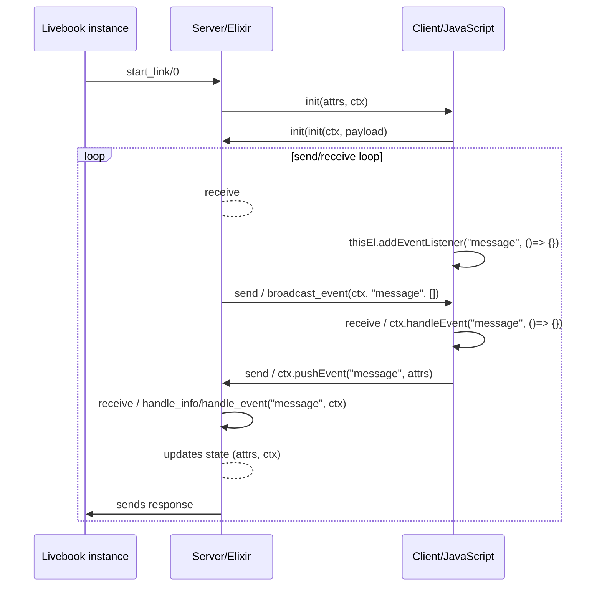

**SMART CELL SEQUENCE** 

```mermaid
sequenceDiagram
Livebook instance ->> Server/Elixir: start_link/0
Server/Elixir ->> Client/JavaScript: init(attrs, ctx) 
Client/JavaScript ->> Server/Elixir: init(init(ctx, payload)
loop send/receive loop
  Server/Elixir --> Server/Elixir: receive
  Client/JavaScript ->> Client/JavaScript: thisEl.addEventListener("message", ()=> {})
  Server/Elixir ->> Client/JavaScript: send / broadcast_event(ctx, "message", [])
  Client/JavaScript ->> Client/JavaScript: receive / ctx.handleEvent("message", ()=> {})
  Client/JavaScript ->> Server/Elixir: send / ctx.pushEvent("message", attrs)
  Server/Elixir ->> Server/Elixir: receive / handle_info/handle_event("message", ctx)
  Server/Elixir --> Server/Elixir: updates state (attrs, ctx)
  Server/Elixir ->> Livebook instance: sends response
end
```